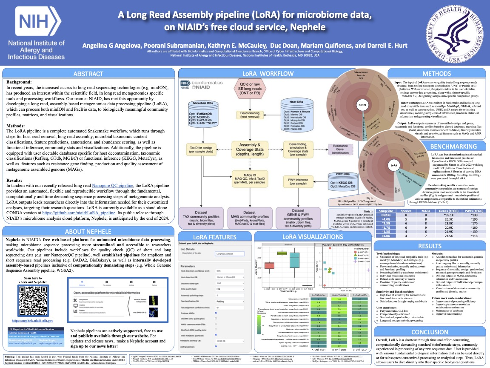

### What is Nephele?

Nephele is NIAID's web application for microbial genomics and microbiome analysis which can be found at **[nephele.niaid.nih.gov](https://nephele.niaid.nih.gov/)**.  

We have pipelines for [QC of sequenced reads](https://nephele.niaid.nih.gov/user_guide_pipes/#qc_pipes), [amplicon metagenomics](https://nephele.niaid.nih.gov/user_guide_pipes/#amplicon_pipes), 
[shotgun metagenomics](https://nephele.niaid.nih.gov/user_guide_pipes/#wgs_pipes), as well as [SARS-CoV-2 viral variant analysis](https://nephele.niaid.nih.gov/user_guide_pipes/#sars_cov2_pipes).

### What is LoRA?

The LoRA pipeline is a complete automated Snakemake-based workflow for long read metagenomic sequencing data processing.
It runs through processing steps of host sequence read removal, long read assembly, microbial taxonomic content classifications,
feature predictions, annotations, and abundance scoring, as well as functional inference, community stats and dataset visualizations. 
The pipeline is equipped with user electable databases specific for host decontamination, taxonomic classifications (RefSeq, GTdb, 
MGBC) or functional inference (KEGG, MetaCyc), as well as features such as resistance gene finding, production and quality
assessment of metagenome assembled genome (MAGs). 

The LoRA pipeline will soon be available publicly and freely thruogh NIAID's microbial analysis platform [Nephele](https://nephele.niaid.nih.gov/).

Visit our poster 
during **ASM NGS 2024**, 
at the Hyatt Regency Washington on Capitol Hill in Washington DC (400 New Jersey Ave NW, Washington, D.C. 20001),
on **Monday Oct 14th**,
In poster session I,  between 2:45-5:15pm 
At Poster Board number: **PIP-MON-135**.

